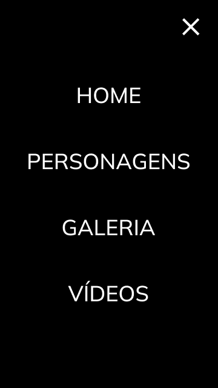

<h1 style="border: none; text-align: center; font-size: 3rem;">Landing Page Concept - Dr. Strange</h1>

Projeto construido durante as aulas de LIMA, no curso de desenvolvimento de sistemas do [SENAI JANDIRA](https://jandira.sp.senai.br/), com orientação do Prof. [Fernando Leonid](https://github.com/fernandoleonid)

    
    

---

## Qual era o objetivo do projeto?

O objetivo era criar uma landing page com base no design feito no [Figma](https://www.figma.com/file/ENs28M3ICC1LZIuYUaGAE1/Dr.-Estranho---Landing-Page?node-id=8%3A30), aprendendo a estrutura do HTML, CSS e JS e conceitos de responsividade

---

## O que é uma landing page?

Landing pages são páginas com goco principal na conversão de visitantes, assim, essas páginas possuem uma estética mas minimalista comparada a outros sites tradicionais

--- 

## Tecnologias usadas

    HTML5
    CSS3
    JavaScript
    Figma

---

## Links

<a href="https://malvzmk1.github.io/dr-strange/" style="background-color: red; color: white;
padding: 10px; border-radius: 0px 20px;">Acesse o Site!</a>
<a href="https://www.figma.com/file/ENs28M3ICC1LZIuYUaGAE1/Dr.-Estranho---Landing-Page?node-id=8%3A30" style="background-color: red; color: white;
padding: 10px; border-radius: 0px 20px;">Projeto no Figma</a>
<a href="https://github.com/MalvzMK1/dr-strange/" style="background-color: red; color: white;
padding: 10px; border-radius: 0px 20px;">Código</a>